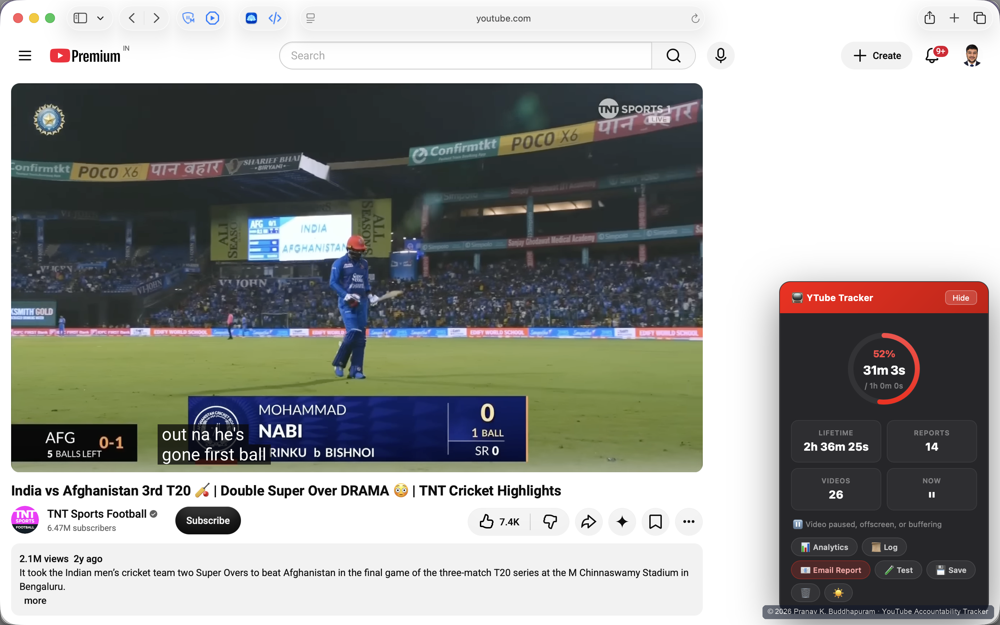
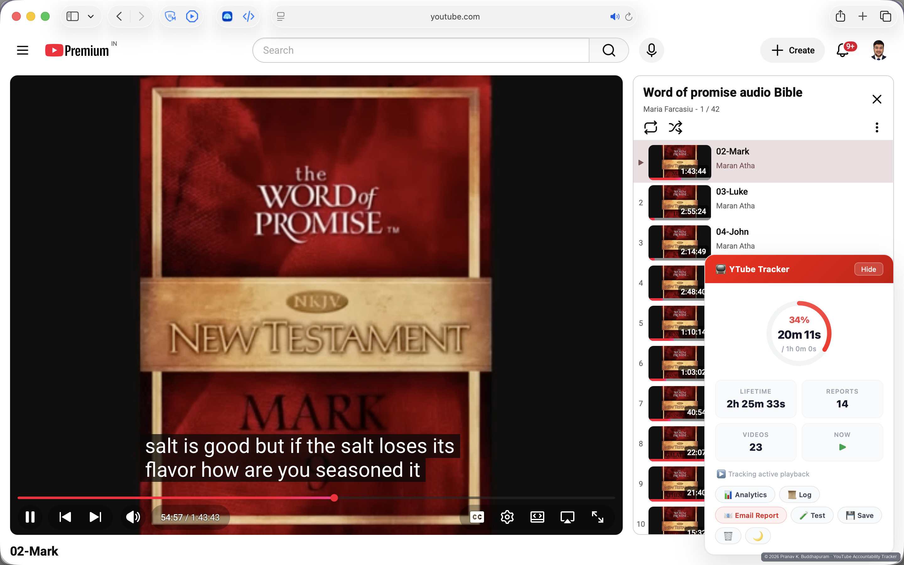
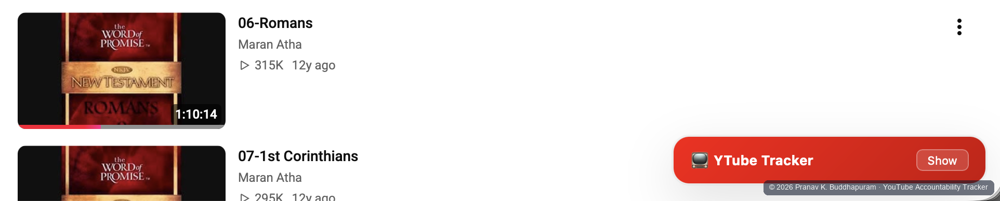
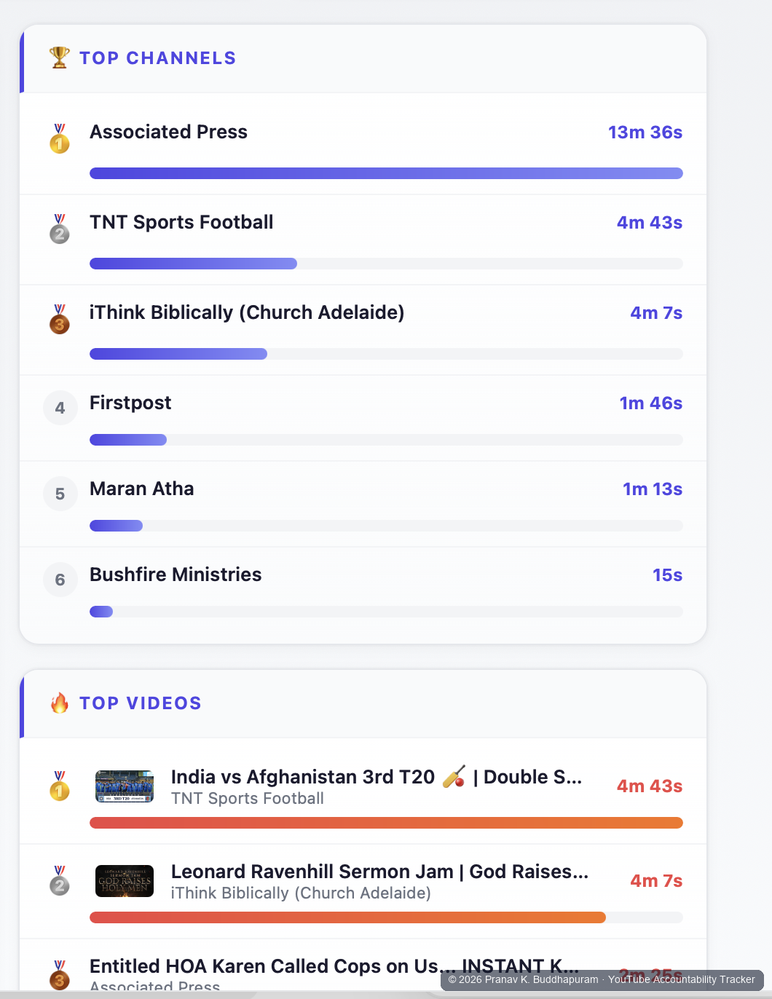
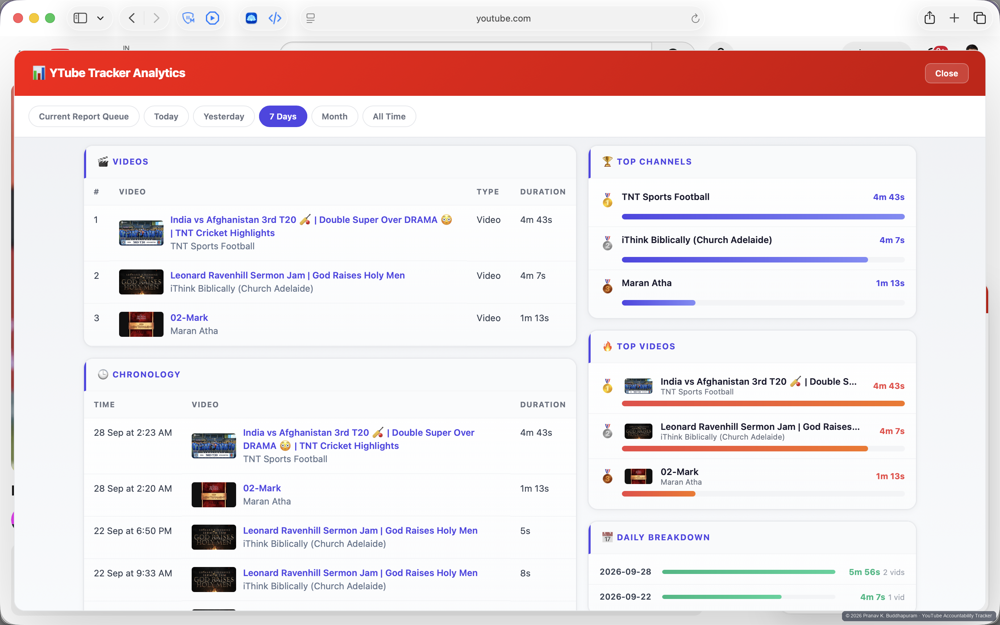
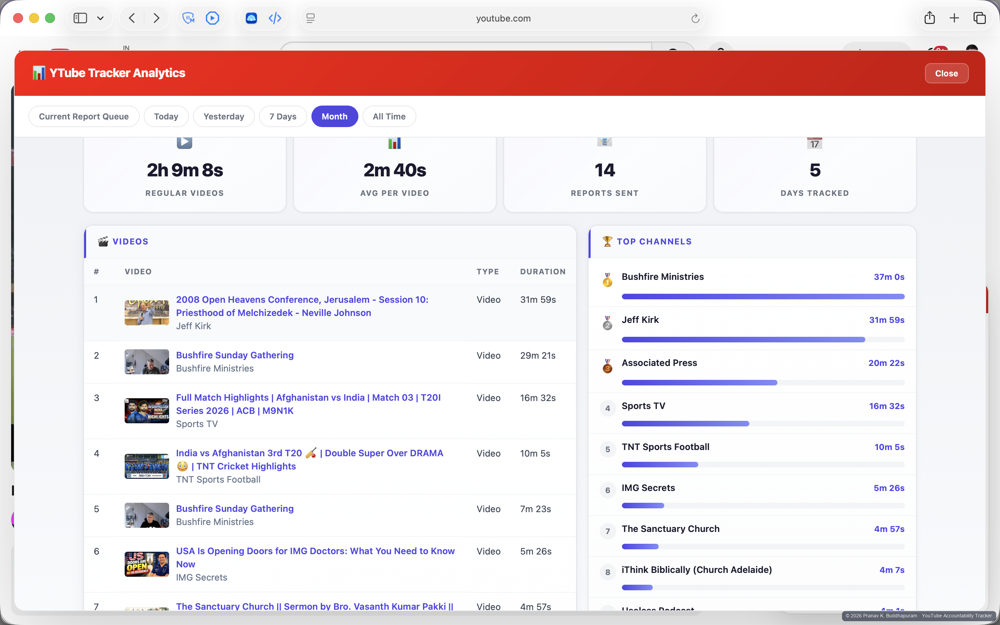
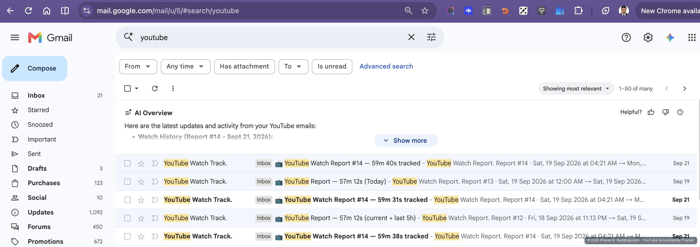
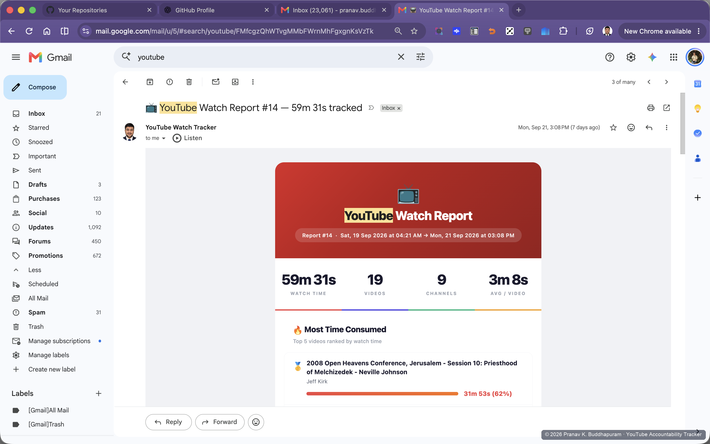
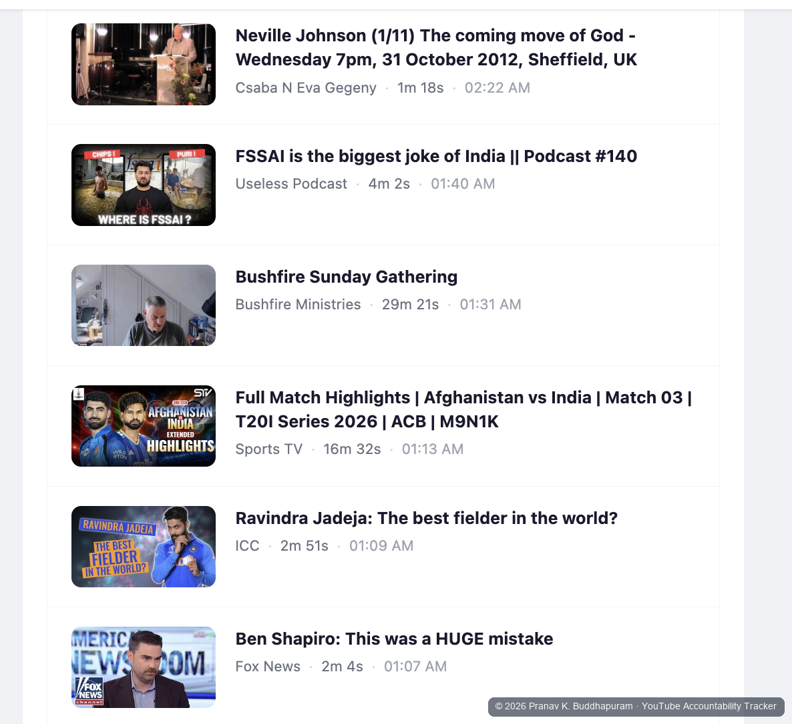

# YouTube Accountability Tracker

### Automated watch-time reporting and accountability for intentional YouTube use

*Browser-side tracking · persistent analytics · automated email reporting · cross-tab coordination · AI-assisted development*

> **Portfolio case study. Source code, credentials, internal prompts, and implementation details are intentionally private.**

I built **YouTube Accountability Tracker** during my OET preparation.

Many of the tutorials I needed were on YouTube, so completely blocking the platform was impractical. At the same time, purposeful viewing could easily turn into unplanned viewing.

One of the most effective screen-time controls I had found for myself was **accountability to another person**. In my case, that person is my wife.

So instead of asking:

> **How do I block YouTube?**

I asked:

> **How can I keep useful YouTube access while making my actual viewing behavior automatically visible to someone I trust?**

The result was a system that tracks actual video playback, maintains local viewing analytics, and automatically sends structured watch reports to an accountability partner.

---

## At a Glance

| | |
|---|---|
| **Platform** | Safari userscript running directly on YouTube |
| **Tracking** | Actual playback rather than simple page-open time |
| **Analytics** | Today, Yesterday, 7 Days, Month, All Time |
| **Views** | Videos, channels, chronology, daily activity, rankings |
| **Reporting** | Automatic watch reports after accumulated viewing |
| **Delivery** | Structured HTML email reports |
| **Cross-tab behavior** | Coordinates multiple YouTube tabs to reduce double-counting |
| **Development** | Iterative AI-assisted prototyping, testing, debugging, and refinement |

---

## Live Tracking

The tracker runs alongside normal YouTube use and shows progress through the current reporting cycle, lifetime tracked time, report count, video count, playback status, analytics, and reporting controls.

It supports both light and dark themes and can collapse when I do not need the full panel visible.

<table>
<tr>
<td width="50%" align="center">

 
<b>Dark-theme tracker during normal YouTube use</b>
</td>
<td width="50%" align="center">

 
<b>Light-theme tracker with live playback statistics and controls</b>
</td>
</tr>
</table>

 
<b>Collapsed state — present without dominating the browsing experience</b>

The goal was not simply to measure how long a YouTube tab stayed open. The system was progressively refined around **actual playback** and practical edge cases such as multiple tabs, pauses, navigation between videos, Shorts, unattended playback, browser interruptions, and failed report delivery.

---

## Seeing the Pattern, Not Just the Total

A number such as *“one hour on YouTube”* tells me very little by itself.

I wanted to know **what consumed that time**.

The analytics layer therefore organizes viewing by video, channel, chronology, and time period.

 
<b>Top channels and videos ranked by tracked watch time</b>

<table>
<tr>
<td width="50%" align="center">

 
<b>7-Day view — chronology, top content, channels, and daily activity</b>
</td>
<td width="50%" align="center">

 
<b>Month view — longer-horizon viewing patterns</b>
</td>
</tr>
</table>

This lets me distinguish an isolated viewing session from a recurring pattern and see which videos or channels repeatedly account for the most time.

---

## The Accountability Layer

The most important feature is that the information does not remain only on my own screen.

After the configured amount of tracked viewing accumulates, the system can automatically generate a structured report and deliver it by email to the designated accountability partner — without requiring me to manually prepare and send the report afterward.

<table>
<tr>
<td width="50%" align="center">

 
<b>Repeated watch reports received in the accountability inbox</b>
</td>
<td width="50%" align="center">

 
<b>Opened report with watch time, video count, channels, and highest-consumption content</b>
</td>
</tr>
</table>

The reports are designed to be understandable at a glance rather than behaving like raw logs. They can include total watch time, video and channel counts, average time per video, highest-consumption content, and detailed watch history.

 
<b>Per-video history with thumbnail, channel, tracked duration, and timestamp</b>

For me, this is the key difference between **measurement** and **accountability**.

A private dashboard can still be ignored. An automatically delivered record creates a different behavioral environment.

---

## Why Not Just Block YouTube?

Sometimes blocking is the right answer, and I use dedicated blocking tools when a website provides little value during a focused period.

YouTube was different because I genuinely needed selected content.

This project therefore explored a middle ground:

**Unrestricted access** → useful, but easy to overuse  
**Complete blocking** → effective, but removes useful content too  
**Accountable access** → useful content remains available while viewing becomes measurable and externally visible

---

## AI-Assisted Development

I did not hand-code the entire application from scratch.

My role centered on:

- defining the problem and desired behavior,
- specifying features and edge cases,
- using AI coding tools to generate and revise implementations,
- testing the system in real use,
- identifying failures and inconsistencies,
- requesting targeted corrections,
- and repeatedly retesting and refining the result.

The project evolved through many cycles of:

**specification → implementation → testing → debugging → validation → refinement**

Specific prompts, model orchestration methods, and private development workflows are intentionally not disclosed.

---

<strong>Technical Notes & Current Limitations</strong>

### Technical characteristics

The current system includes high-level support for:

- active playback tracking,
- cross-tab coordination,
- persistent local history,
- video/channel aggregation,
- chronological analytics,
- Shorts handling,
- local daily and longer-horizon views,
- automatic report generation,
- preservation of unsent data when delivery fails,
- and browser-side light/dark interface state.

The exact synchronization, persistence, reporting, deduplication, and state-management logic remain private.

### Current limitations

This is a **personal accountability system**, not commercial monitoring or parental-control software.

- It is centered on my Safari/userscript workflow.
- It is not designed to be tamper-proof.
- The userscript can ultimately be disabled or removed.
- It does not provide password-protected removal.
- Cross-tab coordination applies within the supported browser environment, not across every browser or device.
- It cannot operate while the browser is completely closed or the computer is asleep.
- It does not monitor activity at the operating-system level of dedicated blocking software.

A version adapted for another userscript-capable browser would be feasible, but it was not necessary for my own use case.

---

## Project Status

**Personal-use system / portfolio case study**

The application remains privately maintained.

The public repository intentionally excludes source code, credentials, email addresses, internal prompts, detailed implementation logic, security-sensitive configuration, and private development methodology.

---

## Author

**Pranav Krishna Buddhapuram**

Orthopaedic surgeon with interests in medical education, research, productivity systems, behavioral self-tracking, and practical AI-assisted software development.

---

## Intellectual Property

© 2026 Pranav Krishna Buddhapuram. All rights reserved.

This repository is a portfolio showcase only. No license is granted for copying, reproducing, redistributing, modifying, reverse-engineering, or commercially using the project, its implementation, or its proprietary design elements.
